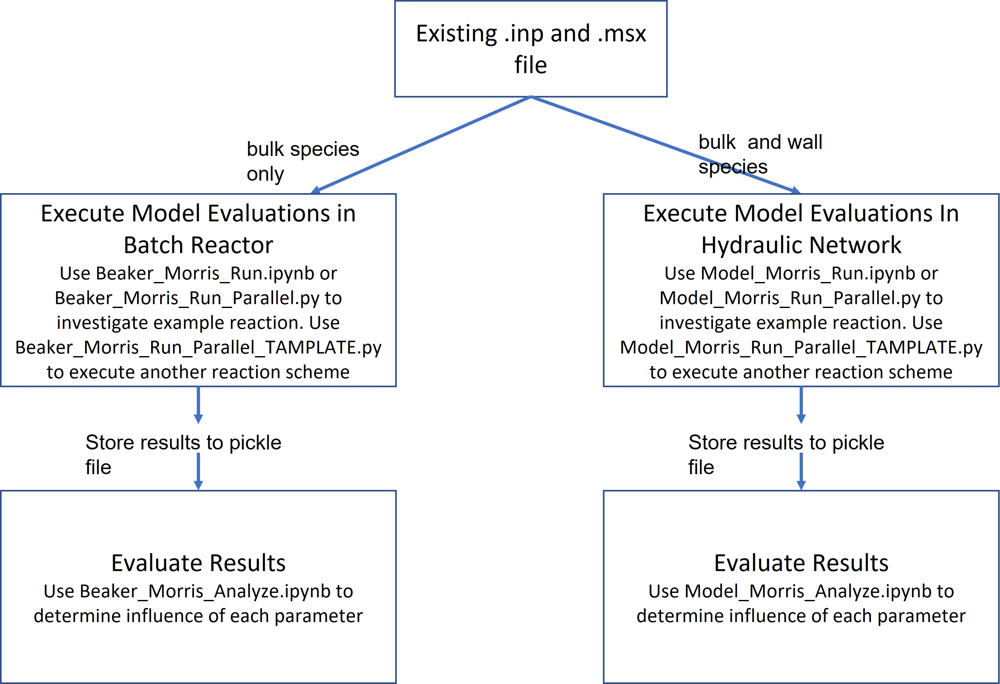

# MSXPY
 **IN DEVELOPMENT** This library of functions and examples is currently under development  
 Set of functions and code to execute EPANET MSX models in Python, and conduct sensitivity analyses
 
 ### Overview
 
This library of functions enables users to execute water quality models within a water distribution system using EPANET MSX, through a wrapper with python. In addition, this repository contains a jupyter notebook and analygous python script to execute sensitivity analyses to determine the relative level of influence of each chemical parameter in a reaction scheme. 

The contents of this repository are as follows:
  
-**EPANET_DLLs** contains the dynamic link libraries for epanet (version 2.0) and epanetmsx (version 1.1)
 
-**Function_Lbraries** which contains python wrappers for DLL functions, and additional functions for manipulation of EPANET MSX models within python
 
-**INP_and_MSX_Files** contains example epanet .inp and .msx files
 
-**Examples_and_Templates** contains Jupyter notebooks and scripts which demonstrate the functionality of this package, as well as provide templates to apply the functions in this package to any particular chemical reaction scheme
Note that the jupyter notebook "**Function Uses and Examples.ipynb"** contains documentation and examples of all functions developed in this package.

### Getting Started

### Dependeencies

Utilization of this package requires installation of the following python packages:
 
-WNTR
 
-Matplotlib
 
-Numpy
 
-Pandas
 
-SALib

### Additional notes

### Examples

### Acknowledgments

This work was supported by the National Science Foundation under Grant 1953206. The authors acknowledge the Texas Advanced Computing Center (TACC) at The University of Texas at Austin for providing high performance computing resources that have contributed to the research results reported in this publication. The authors also acknowledge Samuel Brodfuehrer for consultations during the drafting of this manuscript.
  
  
The python wrapper of msx functions, "msx_toolbox.py" was developed by Junli Hao: https://github.com/junli-h/EPANET-MSX-Python-wrapper/blob/master/epanetmsxmodule.py
 
  
The python wrapper of epanetfunctions, "epanet_toolbox.py" was developed by Gal Perelman, Gonçalo Grilo, and Michael Tryby: https://github.com/OpenWaterAnalytics/epanet-python/blob/dev/epanet-module/epamodule.py

### Contact Us

 Matthew Frankel - mfrankel@utexas.edu
   
 Lina Sela linasela@utexas.edu
 
 **************** IMPORTANT NOTE FOR USAGE ************************
 
In all of the scripts and jupyter notebooks, there is a variable called "main_folder" which contains the file path to the root of this directory. Be sure to change this string to the file path of the machine on which this code is implemented. Note that this also must be changed in the epanet_toolkit.py, mf_msx_toolkit.py, and msx_toolkit.py function libraries in the "Function_Libraries" folder
 
 *******************************************************************
 
This library of functions enables users to execute water quality models within a water distribution system using EPANET MSX, through a wrapper with python. In addition, this repository contains a jupyter notebook and analygous python script to execute sensitivity analyses to determine the relative level of influence of each chemical parameter in a reaction scheme. 

 *******************************************************************

The sensitivity analysis in this package utilizes a method called the Method of Morris, in which multiple model evaluations are contucted to determine the influence of a model parameter on a model output. The method is described in Saltelli(2004): http://www.andreasaltelli.eu/file/repository/SALTELLI_2004_Sensitivity_Analysis_in_Practice.pdf
The result of the Method of Morris is a metric Mu_star, which indicates the level of influence of a parameter on a function output, and sigma, which indicates the level of interaction between a paramater and all others. 

The implementation of the Method of Morris requires two main steps: (1) model evaluations and (2) analysis. In the python scripts included, the evaluation and analysis portions are split into seperate notebooks/scripts. The model evaluation portion saves all model results to a pickle file, which is then read by the analysis script. The advantage of this approach is that model results are saved to a pickle file, so that model evaluations do not need to be re-run multiple times.

The Beaker (batch reactor) is appropriate if all species in the reaction scheme are present in the bulk phase only. The Model analysis (running multiple simulations in a hydraulic network) is required if there are species present in the wall phase.

The "Beaker_Morris_Run.ipynb" and "Model_Morris_Run.ipynb" are duplicated as python scripts. The jupyter notebooks are present to demonstrate the process of executing model evaluations. However, due to incompatabilities between the multiprocessing python module and jupyter notebook, the model evaluations are executed in serial. For faster computation time, use "Beaker_Morris_Run_Parallel.py" and "Model_morris_Run_Parallel.py" which uses the multiprocessing module to evaluate epanetmsx models in parallel.

